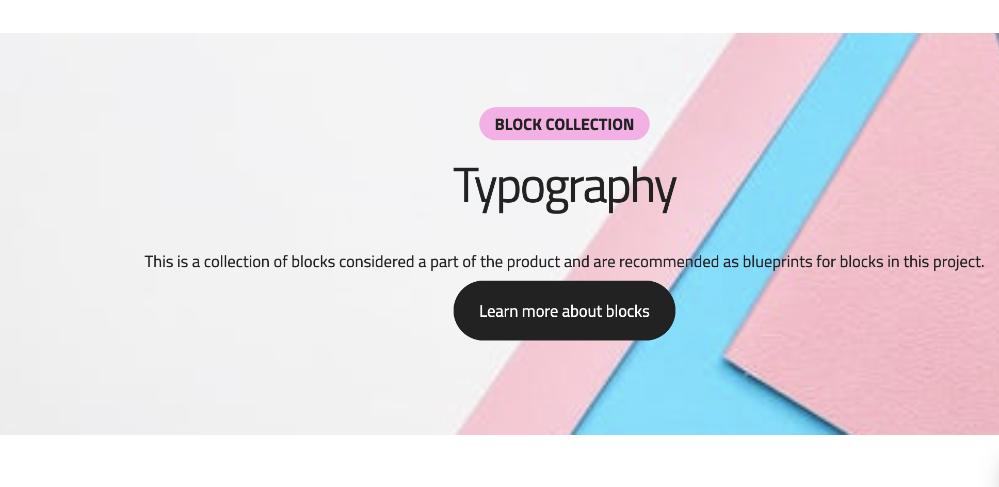

You are an expert Franklin Developer

# Stage Block

**Goal:** Create a Franklin block named stage that displays a banner, this is the intended design

## Key Features:
1. Implement error handling and loading state
2. Use CSS variables for easy customization
3. Ensure accessibility and responsive design

## Requirements

The block should find all 
 content with in the block div element which is "
 tags or triple backticks.  Franklin uses single backtick to denote code

### demo.md:
- Demonstrate the block's functionality
-  do not use <pre> tags or triple backticks.  Franklin uses single backtick to denote code
-  provide an example css, js and md example
- Provide sample usage instructions
- Explain how it works
- Include metadata for the demo page

## Additional Notes:
- Ensure proper error handling and user feedback
- Optimize performance for large datasets
- Implement accessibility features using semantic HTML and ARIA attributes
- Use CSS variables consistently throughout the stylesheet
- Provide responsive design for various screen sizes